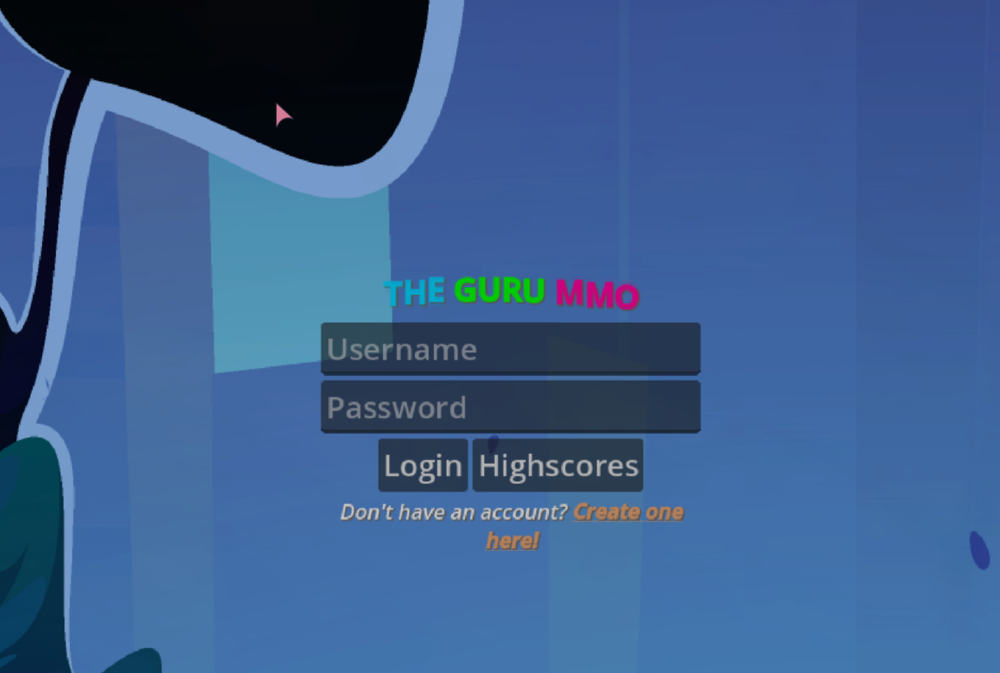
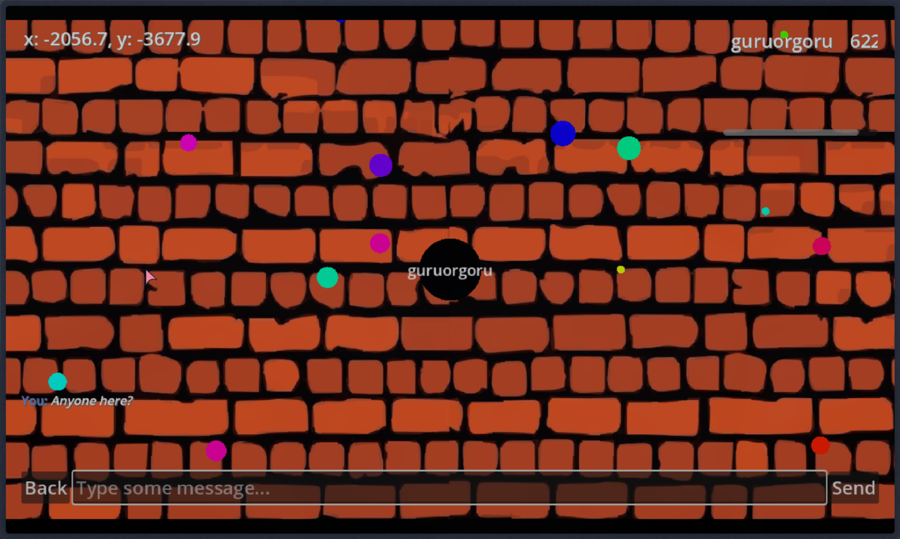
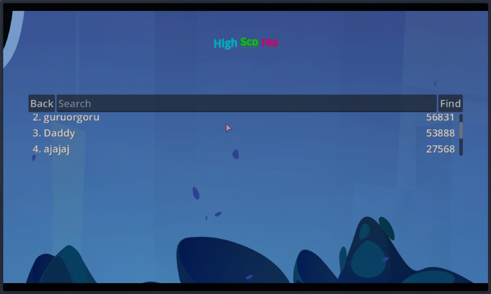
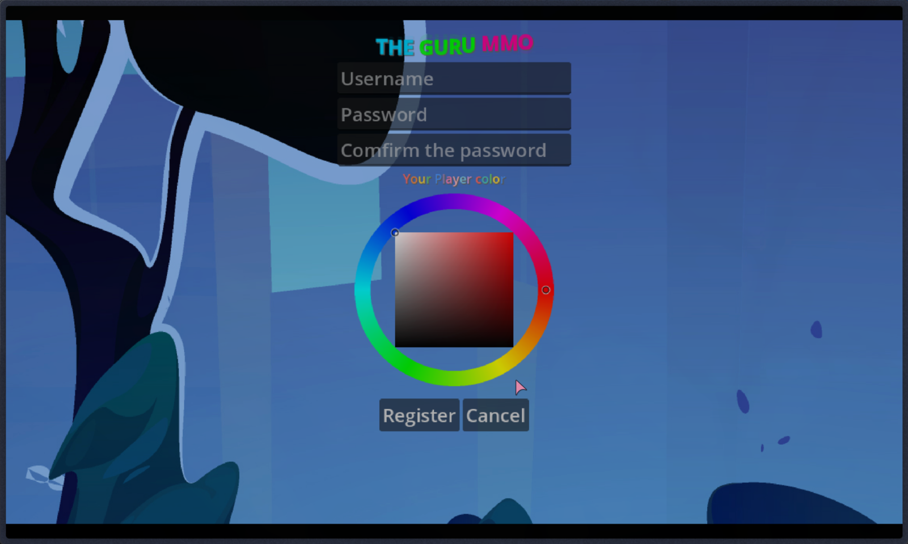

# MMO Game

A multiplayer online game with Godot client and Go server.

## Features
- User registration and login
- Highscores browsing
- In-game multiplayer with actors and spores
- WebSocket communication
- Protobuf for packet serialization

## Setup

### Client (Godot)
1. Install Godot 4.x
2. Open `client/project.godot`
3. Run the project

### Server (Go)
1. Install Go 1.19+
2. `cd server`
3. `go mod tidy`
4. `go run cmd/main.go`

### Docker
- Build: `docker build -t mmo .`
- Run: `docker run -p 8080:8080 mmo`

## Project Structure
- `client/`: Godot game client
  - `addons/`: Custom addons (protobuf, wakatime)
  - `classes/`: UI components (login, register, highscores, logs)
  - `exports/`: Exported web build
  - `mmo33/`: Alternative export
  - `objects/`: Game objects (actors, spores)
  - `resources/`: Assets and themes
  - `states/`: Game states (browsing, connected, entered, ingame)
- `server/`: Go server
  - `cmd/`: Main entry point
  - `internal/`: Internal packages
    - `clients/`: WebSocket client handling
    - `objects/`: Game objects and spawning
    - `server/`: Server logic, DB, states
  - `pkg/`: Shared packages (packets)
- `shared/`: Shared protobuf definitions

### Just a copy of this repo and add the necessary .envs and you're good to go.

## Here are some screenshot of the game:

